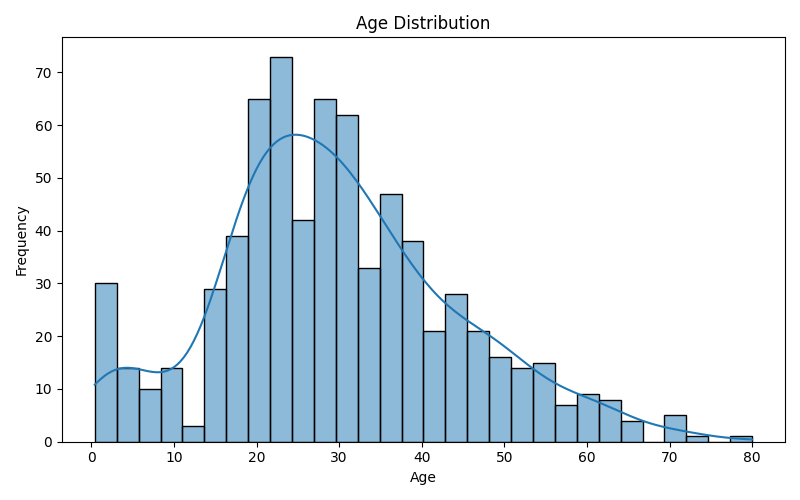
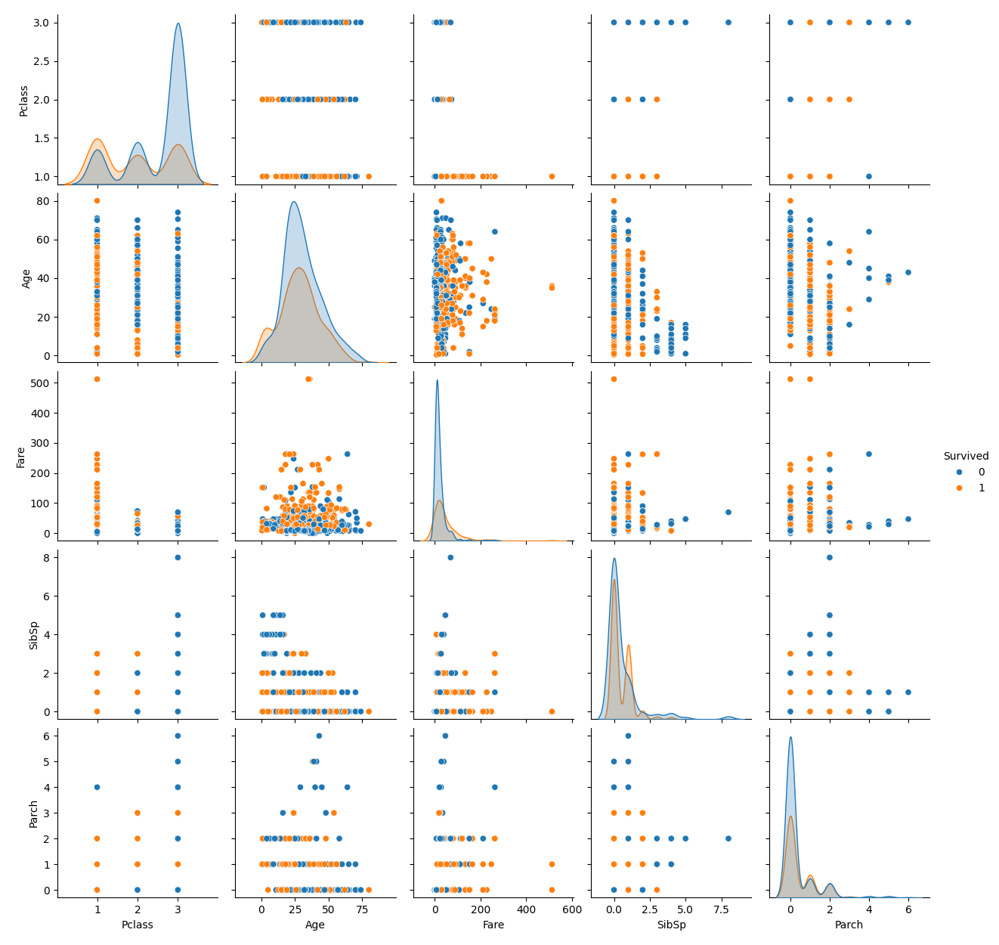

# Titanic Dataset Exploratory Data Analysis (EDA)

This repository contains an Exploratory Data Analysis (EDA) project performed on the famous **Titanic Dataset**. The goal is to understand the data, uncover patterns, visualize distributions, and identify missing values before applying machine learning models.

---

## 📁 Dataset Overview

The dataset contains details of passengers aboard the Titanic, such as:

- Passenger ID
- Survival (0 = No, 1 = Yes)
- Passenger class (1, 2, 3)
- Name, Sex, Age
- Number of siblings/spouses aboard (SibSp)
- Number of parents/children aboard (Parch)
- Ticket number, Fare
- Cabin and Embarkation port (C = Cherbourg, Q = Queenstown, S = Southampton)

---

## 🛠️ Tools Used

- **Python 3.x**
- **Pandas** for data handling
- **Matplotlib** and **Seaborn** for data visualization

---

## 📊 EDA Steps

1. **Viewing First 5 Rows**  
2. **Checking Dataset Info**  
3. **Identifying Missing Values**  
4. **Statistical Summary using `describe()`**  
5. **Histograms**  
   - `age_distribution.png`
   - `fare_distribution.png`
6. **Boxplots**  
   - `boxplot_age.png`
   - `boxplot_fare.png`
7. **Correlation Heatmap**  
   - `correlation_heatmap.png`
8. **Pairplot for Key Features**  
   - `pairplot.png`

---

## 📁 Folder Structure

```
Task 2 AIML/
│
├── Titanic-Dataset.csv
├── titanic_eda.py
├── age_distribution.png
├── fare_distribution.png
├── boxplot_age.png
├── boxplot_fare.png
├── correlation_heatmap.png
├── pairplot.png
└── README.md
```

---

## 📸 Sample Visuals

### Age Distribution  


### Fare Distribution  


### Correlation Heatmap  


### Pairplot  


---

## 🧑 Author

**Harisivanarayana**

---

## 🔗 Repository Name

**titanic-eda-task2**

---

> ✨ This project is a beginner-friendly step in the journey of understanding data science and machine learning!
